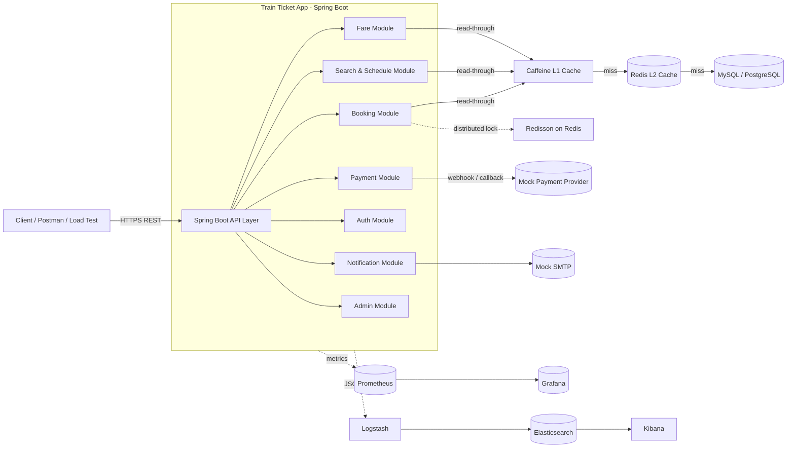

# Train Ticket App — Project Plan (21 Days)

> A backend system for searching trains, booking seats, managing fares, processing
> payments, and issuing tickets — built on Spring Boot with a multi-level cache,
> distributed locking, observability, and centralized logging.

---

## 1. Project Overview

The **Train Ticket App** is a backend service that lets users search train
routes, reserve seats on specific coaches, pay for tickets, and manage their
reservations. The hard parts are **concurrency** (many users racing for the
same seat) and **read scalability** (schedule/fare lookups dominate traffic),
so the design centers on:

- A **multi-level cache** (Caffeine local cache → Redis → MySQL/PostgreSQL)
  for hot read paths (schedules, fares, seat maps).
- **Redisson distributed locks** to serialize seat-reservation critical
  sections and prevent **cache stampede** on cold keys.
- A clear **booking state machine** (`HOLD → CONFIRMED → PAID → ISSUED` /
  `CANCELLED` / `EXPIRED`) so partial failures are recoverable.
- First-class **observability**: Prometheus metrics, Grafana dashboards, and
  ELK-based structured logs from day one.

The deliverable at the end of 21 days is a Dockerized monolithic Spring Boot
service (with module boundaries that allow extraction into microservices later)
plus infrastructure-as-code for local development via Docker Compose, baseline
load tests, and runbooks.

---

## 2. Goals & Non-Goals

### Goals (in scope)
- **G1.** Functional booking flow: search → hold seat → pay → issue ticket → cancel/refund.
- **G2.** Correctness under contention: no double-booked seats, no negative inventory, idempotent payment callbacks.
- **G3.** Read performance: p95 ≤ 50 ms for schedule/fare lookups under 200 RPS on a single node.
- **G4.** Resilience: cache stampede protection, graceful Redis-down fallback to DB, circuit breakers on payment provider.
- **G5.** Operability: Prometheus metrics, Grafana dashboards, structured JSON logs shipped to ELK, health/readiness endpoints.
- **G6.** Reproducible local environment via `docker-compose up`.
- **G7.** Documented APIs (OpenAPI/Swagger) and DB schema with migrations (Flyway).
- **G8.** Baseline test pyramid: unit + integration + a small concurrency/load suite.

### Non-Goals (out of scope for the 21-day window)
- **NG1.** Production-grade payment integration — we use a **mock/sandbox** payment provider.
- **NG2.** Mobile or web UI. We expose REST APIs only; a thin Postman/cURL collection is the demo surface.
- **NG3.** Multi-region or active-active deployment.
- **NG4.** Full microservice split. Modules are decoupled internally but ship as a single deployable.
- **NG5.** Advanced fare optimization (dynamic pricing, ML-based demand forecasting).
- **NG6.** Real-time train tracking / GPS feeds.
- **NG7.** SMS/voice channels. Notifications are email-only (mock SMTP) plus an outbox topic for future fan-out.

---

## 3. Architecture Overview

### 3.1 High-level (Mermaid)



### 3.2 ASCII fallback

```
            +------------------+
            |   Client / LB    |
            +--------+---------+
                     |
                     v
            +------------------+
            |  Spring Boot API |
            +--------+---------+
                     |
   +-------+---------+---------+-------+--------+
   |       |         |         |       |        |
   v       v         v         v       v        v
[Auth] [Search]  [Booking]  [Fare] [Payment] [Notif/Admin]
                     |
                     v
            +------------------+
            |  Caffeine (L1)   |
            +--------+---------+
                     | miss
                     v
            +------------------+    Redisson distributed lock
            |   Redis  (L2)    |<---- on key:seat:{trainId}:{date}:{seatId}
            +--------+---------+
                     | miss
                     v
            +------------------+
            |  MySQL / Postgres|
            +------------------+

Metrics  -> Prometheus -> Grafana
Logs     -> Logstash   -> Elasticsearch -> Kibana
```

### 3.3 Cache strategy

- **L1 (Caffeine, in-process):** ~5–60s TTL, small (~50 MB), absorbs bursty repeat reads on the same node.
- **L2 (Redis):** 5–30 min TTL with **per-key Redisson lock** for cold reload (no stampede), and **negative caching** for missing keys to avoid hot 404s thrashing the DB.
- **Write path:** write-through to DB then explicit invalidation of L1+L2 keys (publish `cache-invalidate` on a Redis pub/sub channel so other nodes flush their L1).
- **Seat reservation** does NOT use cache as the source of truth — DB row-level lock + Redisson lock on `seat:{train}:{date}:{seatId}` is authoritative. Cache is only for read-side seat map projection.

---

## 4. Module Breakdown

| Module | Responsibility | Key entities |
|---|---|---|
| **Auth** | Registration, login, JWT issuance & refresh, password reset, role-based access (USER, ADMIN, OPERATOR). | `User`, `Role`, `RefreshToken` |
| **Search & Schedule** | Search trains by origin/destination/date, list schedules, expose seat-map projection. Heavy read, heavily cached. | `Train`, `Route`, `Station`, `Schedule`, `Coach` |
| **Booking** | Reserve (HOLD) seats, confirm bookings, expire holds, cancel, idempotency keys. Owns the booking state machine. | `Booking`, `BookingItem`, `SeatHold` |
| **Fare** | Compute price (base fare + class + dynamic surcharge), discounts/promo codes. Read-heavy, cacheable. | `FareRule`, `Discount`, `PromoCode` |
| **Payment** | Initiate payment, handle PSP callback (idempotent), reconcile, refund on cancel. | `PaymentIntent`, `PaymentTransaction`, `Refund` |
| **Notification** | Email confirmation, e-ticket delivery, cancellation notice. Async via outbox + worker. | `OutboxMessage`, `NotificationLog` |
| **Admin** | Train/route/schedule CRUD, fare-rule management, manual refund, reports. | reuses above + `AuditLog` |

Each module lives in its own Maven sub-package (`com.trainticket.<module>`) with
`api / application / domain / infrastructure` layers. Cross-module calls go
through application-service interfaces only (no reaching into another module's
repository).

---

## 5. Tech Stack

| Layer | Choice | Why |
|---|---|---|
| Language | Java 21 | LTS, virtual threads available for I/O-heavy workloads. |
| Framework | Spring Boot 3.x | Mature, ecosystem-rich, fits team skill set. |
| Web | Spring MVC + springdoc-openapi | REST + auto-generated OpenAPI/Swagger UI. |
| Persistence | Spring Data JPA + Hibernate, Flyway | Schema migrations versioned in repo. |
| RDBMS | **MySQL 8** (primary), PostgreSQL profile available | Both supported via JPA; pick MySQL for first deployment, keep PG as alternate. |
| Cache L1 | Caffeine | Best-in-class on-heap cache. |
| Cache L2 / Lock | Redis 7 + **Redisson** | Distributed lock, pub/sub for cache invalidation. |
| Async / Outbox | Spring `@Async` + DB outbox table → background worker (later swap to Kafka/RabbitMQ if needed). | Avoids dual-write problem. |
| Auth | Spring Security + JWT (RS256) | Stateless, scales horizontally. |
| Build | Maven (or Gradle) | Standard. |
| Tests | JUnit 5, Mockito, Testcontainers, k6 (load) | Real DB/Redis in integration tests. |
| Containers | Docker + Docker Compose | One-command local infra. |
| Metrics | Micrometer → **Prometheus** → **Grafana** | Standard Spring Boot Actuator path. |
| Logging | Logback JSON encoder → Filebeat → **Logstash** → **Elasticsearch** → **Kibana** | Centralized, searchable. |
| CI | GitHub Actions | Build, test, lint, image push. |

---

## 6. Data Flow — Key Scenarios

### 6.1 Seat Booking (the hot path)

```
1. POST /api/v1/bookings/hold
   { trainId, scheduleDate, seatIds[], passengers[] }
   Header: Idempotency-Key: <uuid>

2. AuthN/AuthZ (JWT) -> resolve userId.

3. For each seatId, acquire Redisson lock:
        seat:{trainId}:{date}:{seatId}     (TTL 10s, waitTime 2s)
   If any lock fails -> 409 SEAT_UNAVAILABLE, release acquired ones.

4. Inside the lock:
   - SELECT seat row FOR UPDATE (DB-level safety net).
   - Verify status = AVAILABLE.
   - INSERT SeatHold (expires_at = now + 10 min).
   - UPDATE seat status = HELD.

5. Compute fare via Fare module (cached).
   Persist Booking(status = HOLD, total, holdExpiresAt).

6. Release Redisson locks. Return bookingId + expiresAt.

7. Client calls POST /api/v1/payments/{bookingId}/initiate
   -> Payment module creates PaymentIntent, returns provider redirect URL.

8. PSP webhook -> POST /api/v1/payments/webhook
   - Verify signature, look up PaymentIntent by providerRef.
   - Idempotent: if already PAID, 200 OK no-op.
   - Mark PaymentTransaction = SUCCESS.
   - Transition Booking HOLD -> CONFIRMED -> PAID.
   - Update seat status HELD -> SOLD.
   - Enqueue OutboxMessage(TICKET_ISSUED) for Notification worker.

9. Notification worker picks up outbox, sends email with e-ticket PDF/QR.

10. If hold expires before payment:
    - Scheduled job releases SeatHold, sets seat AVAILABLE,
      transitions Booking -> EXPIRED, invalidates seat-map cache.
```

### 6.2 Cancellation & Refund

```
1. POST /api/v1/bookings/{id}/cancel  (auth: owner or admin)
2. Validate booking is cancellable (cutoff before departure).
3. Compute refund amount via Fare cancellation policy.
4. Mark Booking -> CANCEL_REQUESTED.
5. Call Payment.refund() -> PSP refund -> on success -> Booking CANCELLED, seat -> AVAILABLE, cache invalidated.
6. Outbox -> notify user.
```

### 6.3 Schedule / Seat-Map Read

```
GET /api/v1/schedules?from=HAN&to=SGN&date=2026-06-01
  -> L1 Caffeine hit  -> return.
  -> miss -> L2 Redis hit -> populate L1 -> return.
  -> miss both -> Redisson lock per cache key -> DB query -> populate L2+L1 -> return.
```

---

## 7. Database Schema Outline

> All tables: `id BIGINT PK`, `created_at`, `updated_at`, `version` (optimistic
> locking) unless stated. Indexes shown are the non-obvious ones.

```sql
-- Auth
users(id, email UNIQUE, password_hash, full_name, phone, status)
roles(id, code UNIQUE)              -- USER, ADMIN, OPERATOR
user_roles(user_id, role_id)
refresh_tokens(id, user_id, token_hash, expires_at, revoked)

-- Catalog
stations(id, code UNIQUE, name, city)
trains(id, code UNIQUE, name, operator)
coaches(id, train_id FK, code, class)            -- e.g. SOFT, HARD, VIP
seats(id, coach_id FK, seat_no, seat_type)
routes(id, name)
route_stops(id, route_id FK, station_id FK, stop_order, arrive_offset_min, depart_offset_min)

-- Schedule
schedules(id, train_id FK, route_id FK, depart_date, depart_time, status)
  INDEX (route_id, depart_date)
schedule_seats(id, schedule_id FK, seat_id FK, status)   -- AVAILABLE / HELD / SOLD
  UNIQUE (schedule_id, seat_id)

-- Fare
fare_rules(id, route_id, class, base_amount, currency, valid_from, valid_to)
discounts(id, code UNIQUE, percent, valid_from, valid_to, max_uses, used_count)

-- Booking
bookings(id, user_id FK, schedule_id FK, status, total_amount, currency,
         hold_expires_at, idempotency_key UNIQUE)
  INDEX (user_id, status), INDEX (status, hold_expires_at)
booking_items(id, booking_id FK, schedule_seat_id FK, passenger_name, passenger_doc, fare_amount)
seat_holds(id, schedule_seat_id FK, booking_id FK, expires_at)

-- Payment
payment_intents(id, booking_id FK UNIQUE, provider, provider_ref, amount, status)
payment_transactions(id, payment_intent_id FK, type, status, raw_payload, occurred_at)
refunds(id, booking_id FK, amount, status, provider_ref)

-- Outbox & Audit
outbox_messages(id, aggregate_type, aggregate_id, type, payload JSON,
                status, attempts, next_attempt_at)
  INDEX (status, next_attempt_at)
audit_logs(id, actor_id, action, target_type, target_id, payload JSON, occurred_at)
```

Constraints:

- `schedule_seats UNIQUE(schedule_id, seat_id)` is the **last line of defense**
  against double-booking; the app-level Redisson lock + `SELECT FOR UPDATE`
  protects throughput, the unique index protects correctness.
- `bookings.idempotency_key UNIQUE` makes hold/confirm requests safe to retry.

---

## 8. API Design (key endpoints)

> All responses are JSON. Errors follow RFC 7807 (`application/problem+json`).
> JWT in `Authorization: Bearer <token>`. All write endpoints accept
> `Idempotency-Key` header.

### Auth
- `POST /api/v1/auth/register`
- `POST /api/v1/auth/login` → access + refresh token
- `POST /api/v1/auth/refresh`
- `POST /api/v1/auth/logout`

### Search
- `GET /api/v1/stations?query=...`
- `GET /api/v1/schedules?from={code}&to={code}&date=YYYY-MM-DD`
- `GET /api/v1/schedules/{scheduleId}/seat-map`

### Fare
- `GET /api/v1/fares/quote?scheduleId=...&seatIds=...&promo=...`

### Booking
- `POST /api/v1/bookings/hold` — body: `{ scheduleId, seatIds[], passengers[] }`, returns `{ bookingId, expiresAt, total }`
- `GET  /api/v1/bookings/{id}`
- `GET  /api/v1/bookings?mine=true&status=...`
- `POST /api/v1/bookings/{id}/cancel`

### Payment
- `POST /api/v1/payments/{bookingId}/initiate` → `{ providerRedirectUrl }`
- `POST /api/v1/payments/webhook` — PSP → us; signature verified; idempotent
- `GET  /api/v1/payments/{bookingId}`

### Admin (role: ADMIN/OPERATOR)
- `POST /api/v1/admin/trains`
- `POST /api/v1/admin/routes`
- `POST /api/v1/admin/schedules`
- `PUT  /api/v1/admin/fares/{id}`
- `POST /api/v1/admin/bookings/{id}/refund`
- `GET  /api/v1/admin/reports/sales?from=...&to=...`

### Ops
- `GET /actuator/health`
- `GET /actuator/prometheus`
- `GET /actuator/info`

---

## 9. Non-Functional Requirements

### 9.1 Performance
- Schedule/seat-map reads: **p95 ≤ 50 ms**, **p99 ≤ 120 ms** at 200 RPS, single 2 vCPU / 4 GB node.
- Booking hold: **p95 ≤ 250 ms** at 50 RPS sustained, with 95%+ success rate against contended seats.
- Cache hit ratio: **L1 > 70%**, **L2 > 90%** on hot keys after warm-up.

### 9.2 Scalability
- Stateless app nodes behind a load balancer; Redis is shared, MySQL primary + read replica path is documented (not implemented in MVP).
- Outbox + worker pattern leaves room to swap to Kafka/RabbitMQ without changing producers.

### 9.3 Reliability
- Hold-expiry job catches up on missed expirations after restart (idempotent).
- Payment webhook is idempotent on `provider_ref`.
- Circuit breaker (Resilience4j) on PSP and Redis.
- Cache miss + Redis-down fallback: serve from DB with degraded latency, alert fires.

### 9.4 Security
- TLS terminated at the LB.
- BCrypt for passwords; password reset via signed time-limited token.
- JWT RS256 with key rotation plan; refresh tokens stored hashed; revocation list in Redis.
- Strict input validation (`@Valid` + bean validation); parameterized queries via JPA.
- Rate limiting (Bucket4j + Redis) per IP and per user on auth + booking endpoints.
- Secrets via env vars / Docker secrets — never committed.
- OWASP Top 10 review checklist completed before final demo.

### 9.5 Observability
- RED metrics on every controller; business metrics: `booking_hold_total`, `booking_hold_failed_total{reason}`, `payment_webhook_total{result}`, `cache_hit_total{layer}`.
- Grafana dashboards: API latency, cache hit ratio, lock contention, DB pool, JVM, business KPIs.
- Alerts: error rate > 1%, p99 > 500 ms for 5 min, payment webhook failure rate > 5%.
- ELK: every log line has `trace_id`, `span_id`, `userId`, `bookingId` when applicable.

### 9.6 Maintainability
- Module boundaries enforced via ArchUnit tests.
- ≥ 70% line coverage on `application` and `domain` layers.
- All public APIs documented in OpenAPI; PRs require updated docs.

---

## 10. Milestones & Timeline (21 Days)

> Working assumption: ~6 focused hours/day, solo developer, weekends included.
> Adjust by ±20% if part-time. Each "Day" below is a checkpoint, not a hard
> time-box.

### Week 1 — Foundations (Days 1–7)

| Day | Milestone | Deliverable |
|---|---|---|
| **D1** | Repo & skeleton | Spring Boot 3 project, Maven multi-module layout, `docker-compose.yml` for MySQL + Redis, `/actuator/health` green. |
| **D2** | Persistence + migrations | Flyway wired, baseline schema (users, stations, trains, coaches, seats), Testcontainers smoke test. |
| **D3** | Auth module | Register/login/refresh, JWT RS256, role seed, Spring Security filter chain, integration tests. |
| **D4** | Catalog & schedule read APIs | `GET /stations`, `GET /schedules`, `GET /schedules/{id}/seat-map` with seed data. |
| **D5** | Caffeine L1 + Redis L2 | Read-through cache abstraction, cache hit/miss metrics, unit tests for invalidation. |
| **D6** | Fare module | Fare rules, quote endpoint, discount application, cached fare lookups. |
| **D7** | Checkpoint #1 | `docker-compose up` brings up app + MySQL + Redis; search & quote flows demo-able via Postman. |

### Week 2 — Concurrency & Money (Days 8–14)

| Day | Milestone | Deliverable |
|---|---|---|
| **D8** | Booking domain | Booking entity + state machine, `POST /bookings/hold` happy path with DB row lock. |
| **D9** | Redisson distributed lock | Per-seat locking, cache stampede protection on cold schedule keys, contention test (50 concurrent threads on the same seat). |
| **D10** | Hold expiry & idempotency | Scheduled job to expire holds, `Idempotency-Key` support, retry-safe hold endpoint. |
| **D11** | Payment module (mock PSP) | `initiate` + `webhook` endpoints, signature verification, payment intent state machine, idempotent transitions. |
| **D12** | Cancellation & refund | Cancel endpoint, refund flow, cache invalidation on state change, audit log entries. |
| **D13** | Outbox + Notification worker | Outbox table, async worker, mock SMTP, e-ticket email with QR. |
| **D14** | Checkpoint #2 | End-to-end happy path: search → hold → pay → ticket emailed → cancel → refund, all via Postman collection. |

### Week 3 — Production Polish (Days 15–21)

| Day | Milestone | Deliverable |
|---|---|---|
| **D15** | Admin module | Train/route/schedule/fare CRUD, RBAC tests, sales report endpoint. |
| **D16** | Observability — metrics | Micrometer + Prometheus + Grafana dashboards (API, cache, locks, JVM, business KPIs) committed as JSON. |
| **D17** | Observability — logs | Logback JSON, Filebeat → Logstash → Elasticsearch → Kibana, sample saved searches & alert rules. |
| **D18** | Resilience | Resilience4j circuit breakers on PSP & Redis, Redis-down fallback test, chaos test (kill Redis container during traffic). |
| **D19** | Performance & load testing | k6 scripts: schedule read at 200 RPS, booking hold at 50 RPS contended, tune connection pools, cache TTLs, indexes. |
| **D20** | Security hardening | Rate limiting, OWASP Top 10 checklist, dependency scan (OWASP Dep-Check), secrets review. |
| **D21** | Release candidate | README, runbook, ARCHITECTURE.md, OpenAPI export, demo script, tag `v0.1.0`, final PR merged. |

### Buffer / risk reserve
Days 19–21 each include ~25% slack to absorb spillover. If we slip on D9 (locking)
or D11 (payment), we re-baseline at the D14 checkpoint and cut from the
non-critical Admin scope on D15 first.

---

## 11. Open Questions / Risks

### Open Questions
1. **Pricing engine depth** — do we need time-of-day/day-of-week dynamic pricing in v1, or are static `FareRule` rows enough? (Default: static.)
2. **Single train per booking?** — does a booking allow multi-leg journeys (transfer trains)? (Default: single-leg in v1.)
3. **Refund policy** — fixed % by cutoff, or per-route? (Default: tiered % by hours-before-departure, configurable per route.)
4. **Seat selection vs. auto-assign** — must users pick a specific seat, or can the system assign? (Default: both supported; auto-assign is a thin wrapper that picks first AVAILABLE.)
5. **Multi-tenancy** — single operator only in v1, or multiple train operators sharing the platform? (Default: single operator; `operator_id` columns reserved for future.)
6. **DB choice** — start MySQL or PostgreSQL? Both are configured; team should pick one as primary on D1 and revisit only if blocked.
7. **Notification channels** — email-only acceptable for demo, or do we need SMS via a third party?

### Risks & Mitigations

| # | Risk | Likelihood | Impact | Mitigation |
|---|---|---|---|---|
| R1 | Double-booking under high contention | Med | High | DB unique index on `(schedule_id, seat_id)` + `SELECT FOR UPDATE` + Redisson lock; concurrency tests on D9. |
| R2 | Cache stampede on cold popular schedule | Med | High | Per-key Redisson lock around DB reload; negative caching for missing keys; jittered TTLs. |
| R3 | Redis outage degrades all reads | Low | High | L1 absorbs short outages; DB fallback path tested on D18; circuit breaker prevents thundering herd. |
| R4 | Payment webhook duplicates / lost | Med | High | Idempotent on `provider_ref`; reconciliation job sweeps `INITIATED` intents older than N min. |
| R5 | Hold-expiry job misses expirations after crash | Low | Med | Job is idempotent and re-scans by `hold_expires_at`; bounded backlog. |
| R6 | Outbox worker lag delays e-tickets | Med | Low | Alert on outbox depth; worker is horizontally scalable. |
| R7 | 21-day timeline slips on observability or hardening | Med | Med | Cut Admin reports & advanced fare features first; non-functional targets are hard requirements. |
| R8 | Test data realism — locking behavior only shows up under load | High | Med | k6 scripts on D19 with explicit contended-seat scenario; CI runs a small concurrency smoke test. |
| R9 | Secret leakage via logs | Low | High | Logback masking config + PR checklist + dependency scan. |
| R10 | Scope creep into UI / mobile | Med | Med | Non-Goals section is explicit; PRs touching UI are rejected unless they're the Postman/Swagger collection. |

---

## Appendix A — Definition of Done (per feature)

A feature is "done" only when:

1. Code merged to `main` via PR with green CI.
2. Unit + integration tests pass; coverage gates hold.
3. OpenAPI updated; example request/response added to Postman collection.
4. Metrics + log fields added; dashboard updated if user-facing.
5. Runbook entry added if it has an on-call dimension (e.g. payment, hold-expiry).
6. PR description includes a manual test plan executed by reviewer.

## Appendix B — Repo Layout (target)

```
train-ticket-app/
├─ docker-compose.yml
├─ infra/
│  ├─ prometheus/  grafana/  elk/
├─ src/main/java/com/trainticket/
│  ├─ auth/         search/        booking/
│  ├─ fare/         payment/       notification/
│  ├─ admin/        common/        config/
├─ src/main/resources/
│  ├─ application.yml
│  ├─ db/migration/                # Flyway
├─ src/test/...
├─ load/                           # k6 scripts
├─ docs/
│  ├─ ARCHITECTURE.md  RUNBOOK.md  API.md
└─ PLAN.md                         # this file
```
